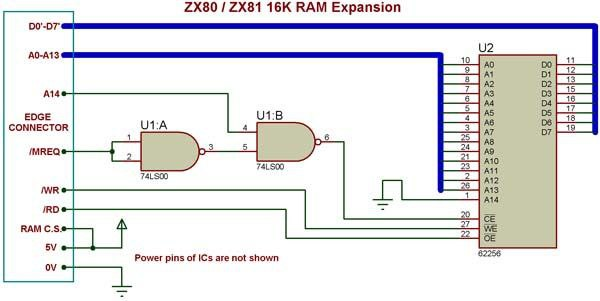
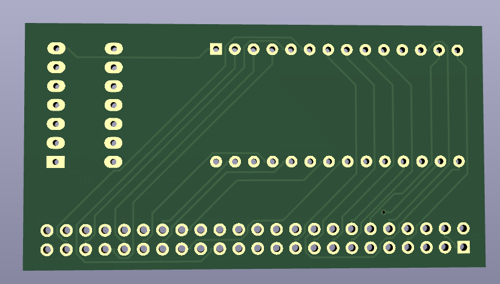
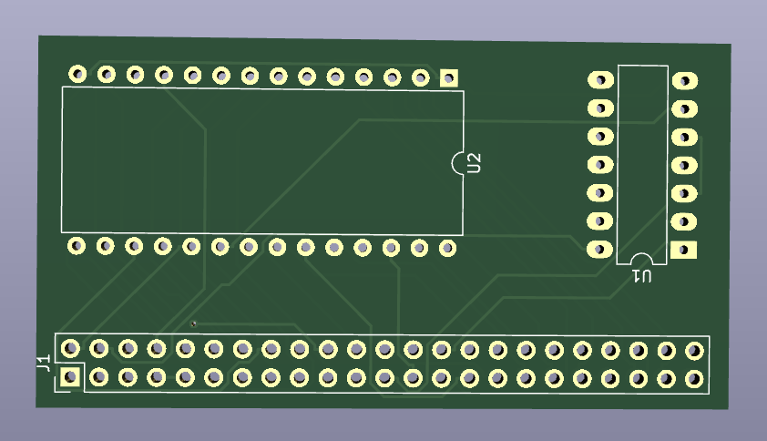

# ZX80 ram expansion card

This expansion card use 2x23 edge connector

## This is redrawn scheema from internet

## Schema and pcb in pdf

* [Scheema](images/zx80-ram-expansion-scheema.pdf)
* [PCB layout](images/zx80-ram-expansion-pcb.pdf)

## 3D renders

